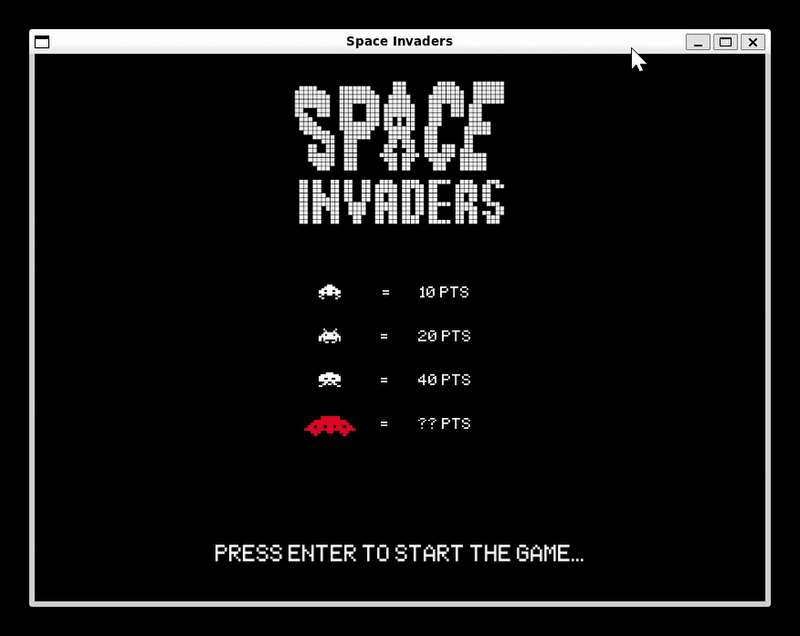

# SPACE INVADERS

A re-creation of the classic arcade game **Space Invaders** developed using Python and PyGame. Relive the nostalgia as you shoot down waves of alien invaders in this entertaining and challenging game.

  

## Setup

### Dependencies

- Python

### Setup

- Install the package installer for python (PIP) and the following library:

  - PIP
  - virtualenv

- Run the following command to create a Python Virtual Environment to install packages. This command will create
  a folder named as '.venv' with all required libraries to run the project.

```bash
python -m virtualenv .venv
```

- Run the following command to open the Python Virtual Environment

```bash

# Windows
.venv\Scripts\activate

# Linux
source .venv/bin/activate
```

- After that, you can install the required packages. Run the following commands:

```bash
pip install --require-virtualenv -r ./requirements.txt
```

## How to run

```bash

python -m src
```

## Author

|                     |
| --------------------------------------------------------------------------------------- |
| <p align="center"> <a href="https://github.com/kaio-giovanni"> @kaio-giovanni </a> </p> |
